# Block Code
### `Gitbook Plugin`

> My first package in npm. I would be grateful for any. 

#### Plugin for formatting blocks of code in gitbook pages.

### Plugin abilities:
* Adds numbering for lines of code.
* Adds a special marker for the code block in the console.
* Adds a button to copy the contents of the code block.
* Formatting the copy button.

<p align="center">
	<h3 align="center">Example</h3>
	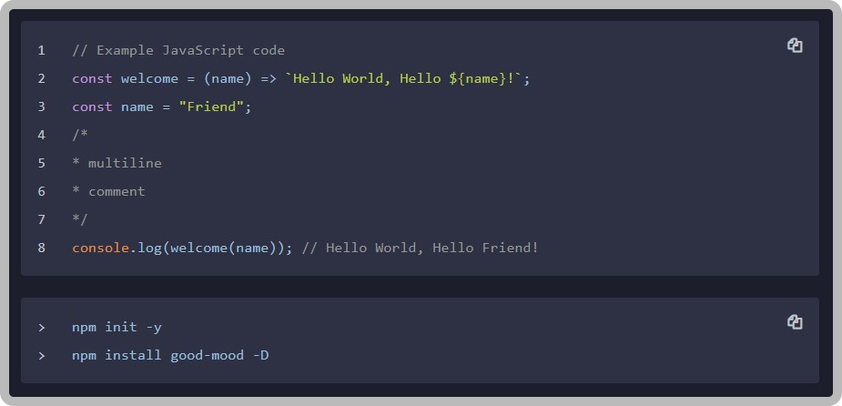
</p>

### Summary

+ [__`Install`__](#install)
+ [__`Plugin Config`__](#plugin-config)

### Install

#### `book.json`
```json
{
	"plugins": [
		"block-code"
	]
}
```

#### `console`
```bash
gitbook install
```

#### or

#### `console`
```bash
npm install gitbook-plugin-block-code
```


### Plugin Config


All basic settings are default.

#### `book.json`
```bash
{
	"pluginsConfig": {
		"block-code": {
			"cloneButton": true,
			"lineNumber": true,
			"cloneButtonStyle": {
				"color": "#c1c7cd",
				"color-hover": "#c1c7cd",
				"bg": "transparent",
				"bg-hover": "transparent"
			},
			"cloneButtonIcon": {
				"clone": "fa-clone",
				"check": "fa-check"
			}
		}
	}
}
```

### Properties

|property|default|available values|
|:-:|:-:|:-|
|__`cloneButton`__|`true`| `true` \| `false`|
|__`lineNumber`__|`true`|`true` \| `false`|
|__`cloneButtonStyle`__|`{}`|contains such fields: `color`, `color-hover`, `bg`,`bg-hover`|
|`color`|`#c1c7cd`      | Format `HEX color` and `transparent`|
|`color-hover`|`#c1c7cd`| Format `HEX color` and `transparent`|
|`bg`|`#c1c7cd`         | Format `HEX color` and `transparent`|
|`bg-hover`|`#c1c7cd`   | Format `HEX color` and `transparent`|
|__`cloneButtonIcon`__|`{}`|contains such fields: `clone`, `check`|
|`clone`|`fa-clone`|`Icon` font in `string format`|
|`check`|`fa-check`|`Icon` font in `string format`|


### More Detail


#### 1. Button for copying the contents of the block with the code.

+ __`cloneButton`__
	+ __`true`__
	+ __`false`__

> #### `true`

<p align="center">
	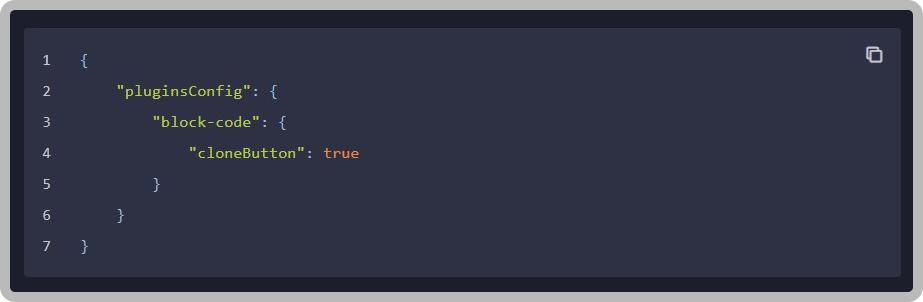
</p>


> #### `false`

<p align="center">
	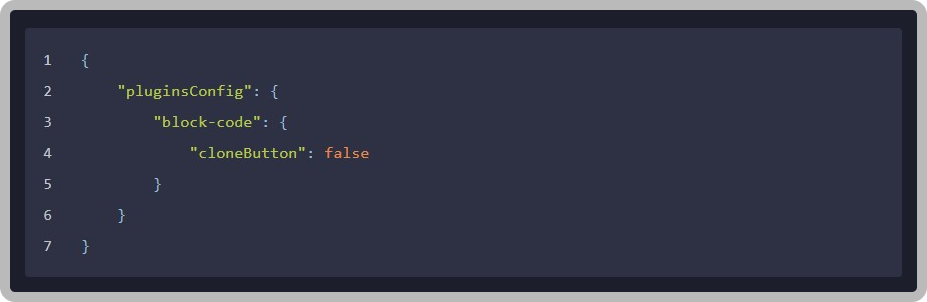
</p>


#### 2. Numbering each line of code.

+ __`lineNumber`__
	+ __`true`__
	+ __`console`__
	+ __`false`__


> #### `true`

<p align="center">
	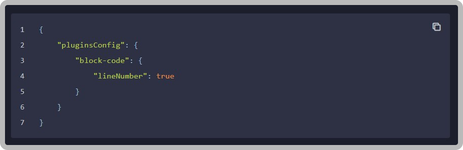
</p>

> #### `console`

<p align="center">
	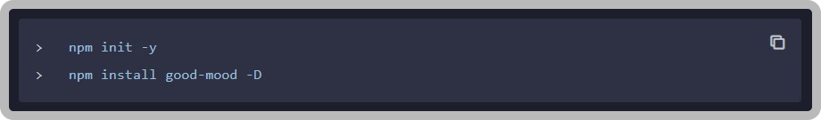
</p>

> #### `false`

<p align="center">
	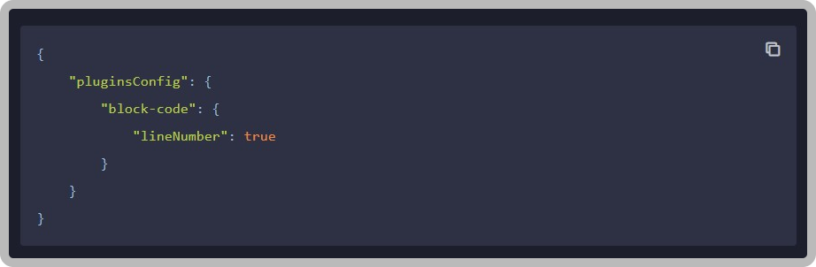
</p>


#### 3. Few styles for the copy button.

+ __`cloneButtonStyle`__
	+ __`color`__
	+ __`color-hover`__
	+ __`bg`__
	+ __`bg-hover`__


> #### `hover`

<p align="center">
	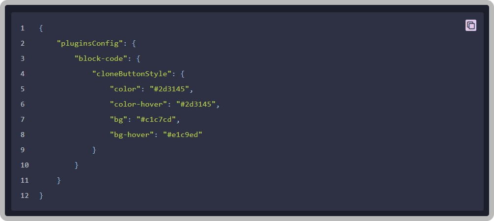
</p>

> #### `active`

<p align="center">
	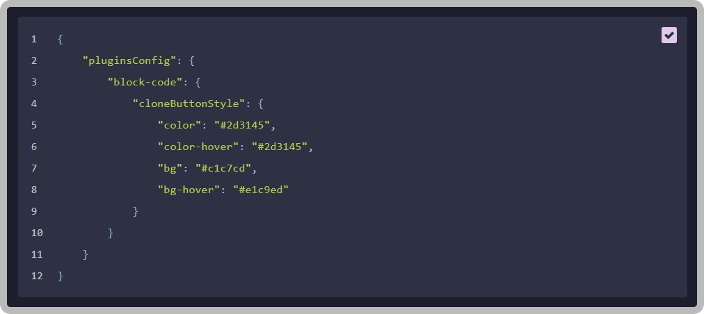
</p>


#### 4. Copy and copy context icons.

+ __`cloneButtonIcon`__
	+ __`clone`__
	+ __`check`__

> In order to replace one of the icons, you need to go to the site [fontawesome.com][fontawesome], select the necessary one and copy the class that begins with `fa-*title*`.

---
> Attention! Not all icons can be displayed, be careful.
---

[fontawesome]: https://fontawesome.com/icons?d=gallery&p=2&m=free

#### Examples of


> #### [`fa-align-justify`][1]
[1]: https://fontawesome.com/icons/align-justify?style=solid

<p align="center">
	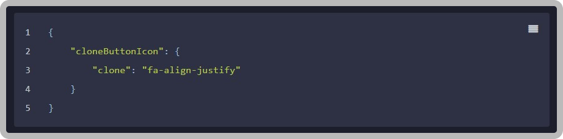
</p>


> #### [`fa-bullseye`][2]
[2]: https://fontawesome.com/icons/bullseye?style=solid

<p align="center">
	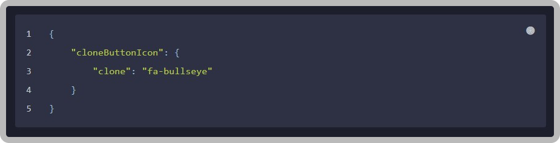
</p>


> #### [`fa-clone`][3]
[3]: https://fontawesome.com/icons/clone?style=solid

<p align="center">
	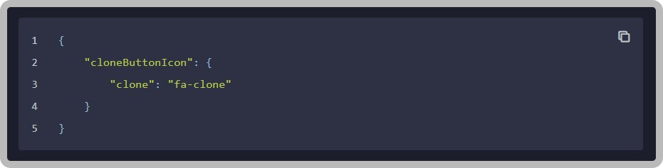
</p>


> #### [`fa-barn`][4]
[4]: https://fontawesome.com/icons/barn?style=solid

<p align="center">
	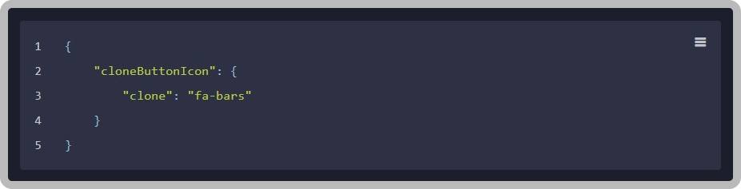
</p>


> #### [`fa-cog`][5]
[5]: https://fontawesome.com/icons/cog?style=solid

<p align="center">
	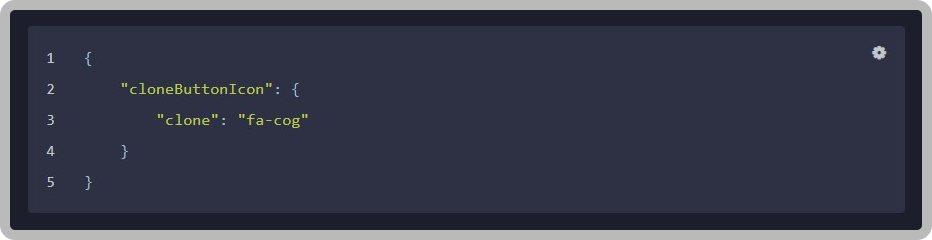
</p>

> #### [`fa-paint-brush`][7]
[7]: https://fontawesome.com/icons/paint-brush?style=solid

<p align="center">
	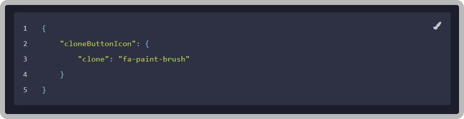
</p>

### Creators

<p align="left">
	<a href="https://github.com/luamoris">
		
	</a>
</p>
